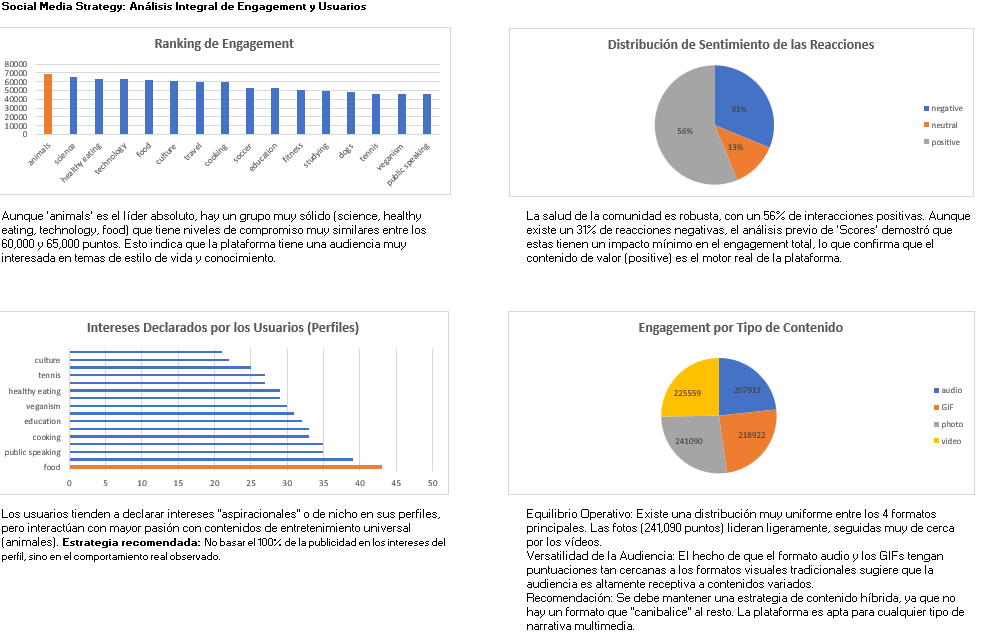

# 🚀 Social Media Content Strategy: Análisis de Engagement con MySQL y Excel

## 📋 Descripción del Proyecto
Este proyecto analiza el comportamiento de los usuarios en una plataforma de redes sociales para identificar qué tipos de contenido generan mayor compromiso (engagement). El objetivo es ayudar a la empresa a tomar decisiones basadas en datos sobre su estrategia de contenidos.

## 🛠️ Herramientas Utilizadas
*   **MySQL (8.0):** Creación de base de datos, auditoría de integridad y consultas complejas (JOINs, Agregaciones).
*   **Microsoft Excel:** Limpieza final, creación de un Dashboard estratégico y visualización de insights.

## 📊 Proceso de Análisis

### 1. Ingeniería y Limpieza de Datos (MySQL)
Se procesaron **7 tablas relacionales** con miles de registros. Los pasos clave incluyeron:
*   **Normalización:** Limpieza de categorías duplicadas y eliminación de caracteres especiales (BOM, comillas) mediante funciones de texto.
*   **Integridad de Datos:** Identificación y eliminación de **3,019 registros huérfanos** (sin User_ID), garantizando la precisión del análisis.
*   **Estandarización:** Unificación de intereses de usuario para obtener métricas fiables.

### 2. Consultas de Negocio
Se desarrollaron queries para extraer:
*   Ranking de categorías por puntuación de engagement (Score).
*   Contraste entre intereses declarados en el perfil vs. comportamiento real.
*   Análisis de sentimiento para evaluar la salud de la comunidad.

## 💡 Hallazgos Principales (Insights)
*   **El Rey del Engagement:** La categoría **'Animals'** lidera con **68,624 puntos**, demostrando que el contenido emocional es el motor de la plataforma.
*   **Brecha de Comportamiento:** Existe una diferencia clara entre lo que el usuario dice querer ('Food/Science') y lo que realmente consume ('Animals').
*   **Salud del Ecosistema:** Un **56% de las interacciones son positivas**, validando la plataforma como un entorno seguro para las marcas.

## 📈 Dashboard Final

